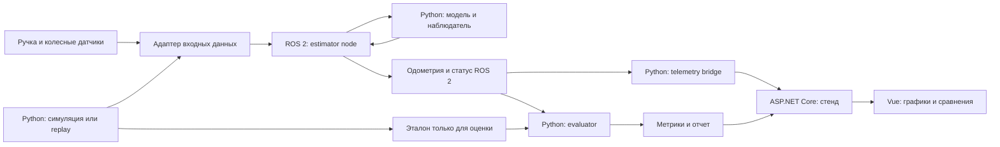

# Архитектура и стек

Уточнение от 19 сентября: [границы компонентов, репозитория и процессов](12-repositories-and-runtime-architecture.md). Оно также фиксирует условную возможность Rust/rclrs из согласованной заявки; ниже сохранено исходное обоснование Python/C++.

## 1. Разделение системы



Физический вход и replay — альтернативные источники. В каждом запуске активен один. Эталон не передается в наблюдатель.

Ядро — обычная Python-библиотека без ROS, HTTP и базы данных. Его можно тестировать и обучать на Windows. ROS-оболочка отвечает за время, топики и жизненный цикл. Стенд получает копию телеметрии: его выключение не должно менять расчет одометрии.

## 2. Выбор технологий

| Контур | Стек MVP | Обоснование |
|---|---|---|
| Модель и наблюдатель | Python 3.10, NumPy; SciPy для офлайн-калибровки | Общий язык DS, автоматизатора и архитектора |
| Робототехника | ROS 2 Humble, `rclpy`, `ament_python`, `colcon` | Python допустим условиями трека; небольшой порог входа |
| ROS-интерфейсы | `rosidl`, `nav_msgs`, `diagnostic_msgs`, собственные сообщения | Типизированные входы и явный статус качества |
| Данные и испытания | Python, pytest, NumPy, pandas, rosbag2 | Повторяемые сценарии и расчет метрик |
| Backend стенда | ASP.NET Core на знакомом команде SDK, REST, SignalR | Независимая работа .NET-разработчика |
| Хранение стенда | SQLite для каталога запусков; файлы для рядов и отчетов | Достаточно для локального хакатонного стенда |
| Frontend | Vue 3, TypeScript, Vite, ECharts | Используем опыт команды, удобные временные графики |
| Проверки интерфейса | Vitest; Playwright при наличии времени | Сначала контрактные примеры и основные состояния UI |
| Среда интеграции | Ubuntu 22.04 + Humble; WSL2/Docker для разработки | Единая Linux-среда для ROS |

Ubuntu 22.04 входит в целевые платформы Humble; C++ и Python представлены в официальном перечне возможностей. [ROS 2 Humble: Features](https://docs.ros.org/en/humble/The-ROS2-Project/Features.html).

Точные patch-версии пакетов, SDK .NET и Node.js фиксируем в начале разработки по рабочей среде команды и lock-файлам. Для MVP не вводим Rust-FFI, React, Kafka, Kubernetes и отдельный сервер БД: их роли уже закрыты выбранными компонентами.

## 3. Предлагаемая структура репозитория

Каталоги ниже — план будущей реализации; сейчас созданы только документы.

```text
docs/                         гипотеза, архитектура, договоренности
contracts/                    JSON Schema, примеры сообщений и model artifact
python/odometry_core/         модель, EKF, диагностика и адаптация
python/odometry_lab/          симуляция, replay, калибровка данных, evaluator
ros2_ws/src/odometry_msgs/    ROS-сообщения
ros2_ws/src/odometry_node/    оболочка ядра, адаптеры, bridge, launch
apps/api/                     ASP.NET Core, каталог запусков, телеметрия
apps/web/                     Vue-приложение
tests/fixtures/               небольшие эталонные наборы для контрактов
tests/integration/            сквозные проверки ROS и replay
infra/                        контейнеры, сборка и команды демонстрации
```

Большие данные, rosbags и автоматически полученные отчеты храним вне Git; в запуске сохраняем путь, хеш и конфигурацию.

## 4. Ноды

- `input_adapter_node`: преобразует формат организаторов в ручку и линейную скорость колес; нормализует единицы и проверяет метки времени. Может входить в процесс оценивателя ради простоты MVP.
- `estimator_node`: буферизует события, последовательно вызывает ядро, публикует продольную оценку, совместимое `Odometry` и диагностику.
- `replay_node`: воспроизводит данные либо симуляцию. Публикует `/clock`, когда включено симуляционное время.
- `telemetry_bridge_node`: подписывается на результат, отправляет прореженную копию на backend; имеет ограниченную очередь и отбрасывает старые кадры при перегрузке.

Сначала один процесс оценивателя с последовательным изменением состояния. Многопоточность вводим только после измерений, чтобы избежать гонок фильтра и случайной перестановки измерений.

## 5. Время, QoS и непрерывная публикация

Вычисления используют время измерения. Нельзя повторно применять старый отсчет как новое измерение на каждом таймере. Поздние сообщения за уже обработанным временем в MVP отклоняются с диагностикой; фиксированный небольшой буфер переупорядочивания допустим, если его задержка учтена в бюджете.

Плановая частота выхода — 50 Гц независимо от частоты UI. Между измерениями публикуем модельный прогноз. При паузе симуляционного времени интегрирование также стоит; скачок времени назад начинает новый эпизод и сбрасывает состояние по правилам инициализации. Длительный разрыв времени не заменяем молча коротким `dt`: либо несколько ограниченных подшагов в допустимом горизонте, либо `INVALID`.

Начальные профили для внутренних топиков: колеса — `best_effort`, `volatile`, `keep_last=5`; ручка — `reliable`, `volatile`, `keep_last=5`; результат и статус — `reliable`, `volatile`, `keep_last=5`. Это проектные настройки: QoS входного адаптера обязательно согласовать с реальными издателями. Для просроченных входов действует собственный timeout; DDS reliability не гарантирует свежесть данных. [ROS 2: QoS](https://docs.ros.org/en/humble/Concepts/Intermediate/About-Quality-of-Service-Settings.html).

## 6. Производительность и решение о C++

Стартовый бюджет при 50 Гц: 20 мс на период; внутренние цели — `p99` времени шага ядра ≤ 2 мс и `p99` от приема входа до выхода ≤ 10 мс на согласованном компьютере. Публикуем также максимум, jitter, пропущенные периоды, число сообщений и характеристики машины. Это цели проверки, не измеренные свойства.

Python позволяет быстро проверить алгоритм, но сам по себе не обеспечивает hard real-time. Даже быстрая C++-функция не гарантирует дедлайн всей ROS-ноды: важны планировщик, память и операции ввода-вывода. [ROS 2 Design: real-time](https://design.ros2.org/articles/realtime_background.html).

В первой четверти хакатона выясняем, проверяют ли организаторы жесткий дедлайн и на каком оборудовании. Если жесткая гарантия обязательна, архитектор выделяет отдельный трек `rclcpp`/C++17 с фиксированными размерами состояния и подготовленной памятью; DS передает формулы и тестовые векторы. Если достаточно проверяемого бюджета задержек, сохраняем Python и профилируем его. Rust не включаем в этот переход: условия явно называют C++ или Python.

При переносе проверяем совпадение последовательностей состояния и ковариации на одних входах. Вынос HTTP, файловой записи и обучения из горячего цикла требуется в обоих вариантах. Замеры hard real-time проводятся в согласованной Linux-среде; результаты WSL2 не выдаем за доказательство детерминированности целевого устройства.

## 7. Минимальный продукт

Обязательны: модель, наблюдатель, качество, адаптация `d`, ROS-пакет, replay, три baseline, отчет метрик и сквозной запуск. Веб-стенд делает их наглядными и разрабатывается параллельно. Карта маршрута, нейросетевая поправка и управление экспериментами из UI — расширения после работающего MVP.
