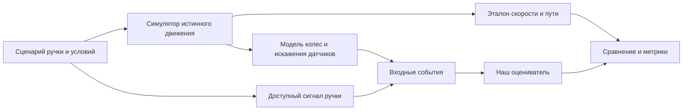

# С чего начать: данные и испытательный стенд

## 1. Что известно об этом хакатоне

На [официальном сайте](https://mt-hackathon.ru/#task), проверенном 15 сентября 2026 года, для трека указаны ручка контроллера, колесная одометрия и разработка пакета ROS 2 Humble. В открытом описании не определены формат датасета, наличие симулятора, независимого эталона или контейнера для проверки. Их выдачу пока не считаем подтвержденной.

На сайте указан дедлайн заявки 22 сентября, 23:59 МСК, открытие 25 сентября и загрузка решения до 27 сентября, 23:59 МСК. Финал — 3 октября. План подготовки ориентируем на раннюю сдачу, а не на дату финала. [Программа и FAQ](https://mt-hackathon.ru/).

## 2. ROS 2, симулятор и запись — разные вещи

**ROS 2** обеспечивает взаимодействие программных компонентов: одна нода публикует сообщения в именованный топик, другая подписывается на него. Например, источник публикует скорость колеса, а наш наблюдатель получает ее и выдает оценку движения. ROS 2 сам по себе не создает физическую модель трамвая. Механизм топиков описан в [официальном учебнике Humble](https://raw.githubusercontent.com/ros2/ros2_documentation/humble/source/Tutorials/Beginner-CLI-Tools/Understanding-ROS2-Topics/Understanding-ROS2-Topics.rst).

**Симулятор** вычисляет условно истинное движение объекта и показания виртуальных датчиков. Он может передавать их в ROS 2, но также может быть обычной Python-программой без графики.

**Запись, или rosbag**, хранит сообщения с временными метками. `ros2 bag play` воспроизводит сообщения в топики, позволяя подавать ранее записанные данные в ноду. Это воспроизведение фиксированной поездки: изменение ручки пользователем не пересчитает ее физику. Для интерактивной реакции нужен симулятор. [rosbag2, ветка Humble](https://github.com/ros2/rosbag2/tree/humble).

Следовательно, для первого тестирования реальные датчики и трехмерная сцена не обязательны. Нужен источник правильно сформированных входных сообщений и способ независимо проверить результат.

## 3. В каких формах могут выдать материалы

Это возможные варианты поставки, а не обещания организаторов и не оценка вероятности.

| Вариант | Что получаем | Как подключаем | Чего может не хватать |
|---|---|---|---|
| Табличные записи | Время, ручка, скорости колес; иногда эталон | Адаптер файла → события ядра или ROS-издатель | Единиц, синхронизации, описания эталона |
| ROS 2 bags | Записи топиков | Воспроизведение → адаптер → оцениватель | Пакетов собственных `.msg`, совместимых QoS, калибровки |
| Симулятор | Программа/контейнер с виртуальным трамваем | Подписка на выдаваемые топики | Доступа к истине, управления сценариями, описания физики |
| Стартовый репозиторий | Типы сообщений, launch, заглушка ноды, Dockerfile | Подключаем наше ядро к интерфейсу | Данных для идентификации и полноценной проверки |
| Закрытый оценочный стенд | Формат отправки и итоговые метрики | Упаковываем решение по контракту | Локального примера и объяснения ошибок |
| Живой или удаленный поток | Сообщения реального оборудования | Адаптер потока | Повторяемости экспериментов и независимого эталона |

Комбинация записей и закрытой проверки также возможна. Подготовку строим так, чтобы источник можно было заменить одним адаптером.

## 4. Минимум, который стоит запросить

Для первого подключения достаточно одного небольшого примера — ориентировочно 1–5 минут разгона, выбега и торможения. Для обучения и доказательства качества потребуется более разнообразный набор поездок.

Вместе с примером нужны:

1. **Словарь данных:** поля/топики, типы сообщений, единицы, частоты, кодировка ручки, число колесных каналов.
2. **Время:** что означает timestamp, синхронизированы ли источники, есть ли задержки, отличается ли время измерения от времени записи.
3. **Калибровка:** радиусы колес, если выдается угловая скорость; значение нулевой ручки, тяги, торможения и реверса.
4. **Инициализация:** откуда брать начальные скорость и позицию, нужно ли поддерживать старт на движущемся трамвае.
5. **Эталон:** есть ли независимо измеренные скорость/путь, откуда они получены, какова их точность и разрешено ли использовать их офлайн.
6. **Проверка:** выходной формат, метрики, длительность отказов, допустимые ошибки, правила учета недействительной оценки.
7. **Среда:** CPU, ОС, частота публикации, ограничения времени и памяти, предоставляемый Docker/репозиторий и требования к сборке.

Самый важный вопрос для DS: **с чем сравнивать оцененную истинную скорость в момент, когда колесная скорость ошибочна?** Если эталон построен из тех же колес, он не дает независимой проверки проскальзывания. Если эталон есть только у жюри, полезны хотя бы небольшой открытый пример и возможность пробного запуска на стенде.

## 5. Готовое сообщение организаторам

Текст ниже подготовлен для самостоятельной отправки командой; автоматически он не отправлялся.

> Здравствуйте! Готовим командную заявку на трек «Резервная одометрия по модели» и хотим заранее организовать разработку и тестирование. Подскажите, пожалуйста:
>
> 1. В каком виде и когда участникам выдадут данные: файлы, ROS 2 bags, симулятор или доступ к тестовому стенду? Можно ли заранее получить небольшой пример и описание полей/топиков?
> 2. Будут ли отдельные скорости колес, временные метки, радиусы колес и описание режимов ручки контроллера? Если используются собственные ROS-сообщения, предоставят ли пакет интерфейсов?
> 3. Есть ли независимая эталонная скорость и положение для обучения и локальной проверки? Допустимо ли их офлайн-использование при отсутствии GNSS/IMU во входах рабочего алгоритма?
> 4. Что требуется выдавать как положение: относительный путь или координаты на маршруте? Какие начальные условия и карта будут доступны?
> 5. Какие метрики, горизонты отказов, частота выхода и ограничения задержки будут проверяться? Какое оборудование и среда сборки используются?
> 6. Будут ли стартовый репозиторий, контейнер и пример запуска проверки? Как будут оцениваться признаки недостоверности и неопределенность результата?
> 7. Что разрешено подготовить до открытия: окружение, универсальный стенд, собственные библиотеки или часть решения?
>
> Спасибо! Эти сведения помогут нам подготовить совместимые интерфейсы и воспроизводимые испытания.

Контакт поддержки, опубликованный на сайте: `ask@pgenesis.ru`; ссылка на чат находится в FAQ. [Контакты хакатона](https://mt-hackathon.ru/).

## 6. Наш тестовый стенд до получения данных

Предлагаем сделать небольшой одномерный симулятор на Python. Его первая задача — обеспечить повторяемые входы и проверить интеграцию. Он не заменяет проверку на реальном трамвае.



Управление сценарием, параметры физики и эталон закрыты от оценивателя. Входом ему служат только события по [контракту v0.1](03-contracts.md).

### Что умеет первая версия

- Выполнить последовательность «тяга → выбег → торможение».
- Рассчитать истинные скорость и путь в выбранной синтетической модели.
- Создать виртуальную колесную скорость и добавить шум.
- На заданном интервале завысить показания, занизить их, заморозить значение или пропустить сообщения.
- Сохранить входы, эталон, конфигурацию и seed раздельно.
- Повторить эксперимент с тем же результатом.

Например, синтетический трамвай движется со скоростью 10 м/с, а датчик на участке сообщает 14 м/с. Мы проверяем, насколько оцениватель отклонился от известного эталона. В другом тесте при тех же 10 м/с колесный канал сообщает ноль — так проверяем отсутствие ложного подтверждения остановки. Это иллюстрации проверки измерительного канала, а не реалистичная модель всего процесса сцепления.

### Два уровня сложности физики

**Первый уровень — искажение измерений.** Истинная динамика остается заданной, мы портим только колесный сигнал. Этого достаточно для тестов формата, детектора и обработки пропусков.

**Второй уровень — изменение движения и колес одновременно.** При плохом сцеплении меняются передаваемая тяга/торможение и вращение колес. Добавляем ограничение эффективного воздействия, отличающиеся задержки, внешнее ускорение и общие ошибки каналов. Иначе наблюдатель получит слишком легкую задачу: идеальная модель продолжит предсказывать движение даже там, где реальная физика изменилась.

Автоматизатор реализует симулятор отдельно от модели DS. Для испытаний используем другие параметры и часть иных зависимостей; совпадение с собственным уравнением проверяет реализацию, но слабо подтверждает устойчивость решения.

## 7. Как связать стенд с ROS 2

Один генератор поддерживает два пути:

- **Офлайн:** входные события → Python-ядро → полный ряд оценок → отчет. Быстрое сравнение алгоритмов без ROS.
- **Интеграционный:** те же события → ROS-издатель → адаптер/нода → топики результата. Проверка времени, интерфейсов, пропусков и публикации.

Начальные артефакты запуска: `scenario.json`, `events.jsonl`, `truth.jsonl`, `estimates.jsonl`, `report.json`. Это предлагаемые файлы будущего стенда, сейчас они не созданы. JSONL содержит по одному JSON-объекту на строку; формат полезной нагрузки следует общему контракту. Внешние табличные данные будем преобразовывать в тот же поток событий.

До реальных датчиков работают наши издатели. После получения записи или симулятора организаторов источник заменяется, а ядро, метрики и UI остаются прежними.

Если выдали bag, первые диагностические команды после установки ROS 2 и необходимых пакетов:

```bash
ros2 bag info /path/to/bag_directory
ros2 bag play /path/to/bag_directory
ros2 topic list -t
```

Путь здесь — пример, команды сейчас не запускались. Перед рабочим replay настраиваем единый источник времени, совместимость QoS и доступность пользовательских типов сообщений. Чтение метаданных bag само по себе еще не подтверждает готовность подписчика декодировать все его сообщения. Документация: [rosbag2 Humble](https://github.com/ros2/rosbag2/tree/humble), [топики Humble](https://raw.githubusercontent.com/ros2/ros2_documentation/humble/source/Tutorials/Beginner-CLI-Tools/Understanding-ROS2-Topics/Understanding-ROS2-Topics.rst).

## 8. Что делаем сначала

1. Отправляем вопросы организаторам и уточняем допустимую подготовку до старта.
2. За один командный созвон разбираем входные сигналы, единицы и контракт v0.1; отмечаем предположения.
3. Распределяем [пять первых задач](10-first-tasks.md): генератор, baseline, ROS-каркас, API на фикстурах, графики.
4. Собираем первый общий результат: один сценарий проходит от источника до оценки и отчета.
5. При появлении данных сначала исследуем формат, диапазоны, время и качество, затем калибруем модель и подключаем реальный источник.

Первый рубеж — воспроизводимый разгон с одним отказом и численно рассчитанной ошибкой базового алгоритма. Он позволяет начать исследование с измеримого результата и дает всем участникам общий материал для разработки.
