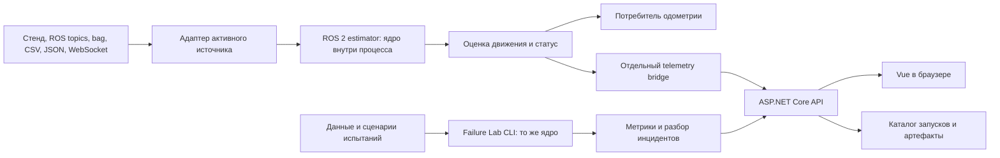

# Архитектура реализации: репозиторий, приложения и процессы

Дата: 19 сентября 2026 года. Статус: предлагаемое решение для старта реализации, с учетом согласованной командой заявки. Код компонентов и удаленные репозитории в рамках этого документа не создавались.

## 1. Рекомендация

**Один Git-репозиторий, три функциональные части, один веб-backend.**

Три части продукта:

1. **Odometry Runtime** — ROS 2-пакеты для приема данных и оценки движения.
2. **Failure Lab** — Python-инструмент генерации, воспроизведения, сравнительных испытаний и отчетов.
3. **Experiment Console** — ASP.NET Core API и Vue-интерфейс экспериментов.

Математическое ядро — отдельная Python-библиотека, которую используют Runtime и Failure Lab. Она не является отдельным сетевым сервисом. Для демонстрации добавляется отдельный процесс передачи телеметрии из ROS в API.

Пять участников работают в одном репозитории, но каждый владеет своей областью. Число участников не определяет число репозиториев или микросервисов.

## 2. Что именно считаем

| Сущность | Что означает у нас | Решение на старте |
|---|---|---|
| Репозиторий | История изменений, совместимые версии, PR | Один — текущий `odometry-service` |
| Библиотека | Импортируемый код без собственного сервера | Ядро и общий слой преобразования источников |
| ROS-нода | Компонент с ROS-интерфейсом | Оцениватель, источник/replay, bridge; внешний адаптер по необходимости |
| Процесс | Запущенная программа с собственной памятью | Разделяем оцениватель, bridge и API |
| Веб-backend | HTTP/SignalR API стенда | Один ASP.NET Core backend |
| Frontend | Приложение в браузере | Одно Vue-приложение |
| Контейнер | Упаковка среды исполнения | Определяем после первого работающего запуска |

Один репозиторий может содержать несколько независимо запускаемых программ. И наоборот, разделение кода на пять репозиториев не создает полезных границ исполнения автоматически.

## 3. Потоки данных



Офлайн-проверка использует то же ядро напрямую. Отдельный интеграционный запуск Failure Lab подает события через ROS и проверяет полную цепочку Runtime. Независимый эталон поступает только в evaluator внутри Lab, не в оцениватель.

### Вычислительный путь

`Вход → проверка времени/единиц → прогноз → коррекция → качество → выход ROS`.

Здесь не должно быть обращения к HTTP, БД, LLM или удаленному ML-сервису. Состояние фильтра изменяется последовательно одним владельцем. Все измерения конкретного трамвая направляются в один экземпляр наблюдателя: балансировать соседние сообщения по разным экземплярам нельзя.

### Наблюдение и анализ

`Выход ROS → bridge → API → браузер`.

Bridge работает отдельно от оценивателя, имеет ограниченную очередь и может отбрасывать старую экранную телеметрию. Медленный API не должен блокировать вычисления. На UI передается прореженный поток; научные метрики вычисляются по полным записям. Потери полной записи фиксируются и учитываются в отчете, а не скрываются прореживанием.

## 4. Границы компонентов

### 4.1. `odometry_core`: библиотека алгоритма

Внутри: динамическая модель, наблюдатель, адаптация, контроль качества и состояние оценки. Вход: нормализованные события и конфигурация. Выход: структура `Estimate` по [контракту](03-contracts.md).

Ядро не знает, пришло измерение из CSV, ROS или WebSocket. Колесные каналы идентифицируются по `wheel_id`; число каналов задается конфигурацией, без жесткой привязки к двум/четырем колесам. Для ограниченного времени обработки задаем максимум каналов и правила отказа при некорректном входе. «Произвольное число» в заявке означает настраиваемое количество, а не неограниченную память и нагрузку.

Возможный ML-классификатор после появления разметки подключается как локальный модуль оценки качества. Его вычислительная стоимость входит в бюджет шага; отсутствие модели не блокирует работу базовой диагностики. Обучение выполняется отдельно.

### 4.2. `odometry_io`: библиотека адаптеров

Рекомендуем выделить небольшой общий Python-пакет для чтения CSV/JSON, профилей полей, единиц и преобразования данных. Для ROS используются оболочки в ROS-пакете, для WebSocket — отдельный источник с ограниченной очередью; сетевое ожидание не входит в шаг фильтра.

Профиль источника описывает имена полей/топиков, единицы, кодировку управления, часы и идентификаторы каналов. Семантическое преобразование общего поля реализуется один раз и используется в онлайн- и офлайн-пути.

Одновременно активна одна конфигурация источника для одного запуска: она может объединять отдельные топики ручки и колес. Автоматического слияния повторяющихся данных из bag и живого потока нет. Источник переключаем между запусками с новой инициализацией; бесшовное переключение — отдельная будущая задача.

Сначала реализуем источник, который нужен для интеграционного прогона, и один файловый формат для фикстур. Остальные адаптеры подключаем по тому же интерфейсу после работающего первого прогона.

### 4.3. ROS Runtime

`estimator_node` импортирует ядро и отвечает за ROS-время, события, публикацию и конфигурацию. Небольшое преобразование ROS-сообщения может выполняться в том же процессе; отдельный `input_adapter_node` нужен только при реально отличающемся внешнем интерфейсе или блокирующем источнике.

Пакет `odometry_msgs` содержит определения сообщений, но сам ничего не запускает. Launch собирает нужный режим из источника, оценивателя и необязательного bridge. Пакет сдачи должен работать без API, браузера и Failure Lab.

### 4.4. Failure Lab

Это CLI-приложение и набор библиотек, а не постоянно работающий сервер. Оно управляет сценариями, запускает сравниваемые алгоритмы, вызывает evaluator и сохраняет артефакты запуска. Реализуем один общий расчет метрик для всех способов подачи данных.

Разбор инцидентов сначала формируем детерминированно по событиям: время начала, каналы, переходы режимов и изменение ошибки при наличии эталона. Если эталона нет, показываем изменение неопределенности и прямо отмечаем, что фактическая ошибка неизвестна.

LLM/Gemma — опциональное офлайн-дополнение к готовому отчету. Ее отсутствие не мешает завершить тест. Отдельный LLM-сервис в MVP не нужен; такой компонент и модель выбираем только после базовых испытаний.

### 4.5. API и Vue

Один ASP.NET Core API владеет каталогом запусков, приемом телеметрии, хранением отчетов и их выдачей. Внутри можно выделить модули `Runs`, `Telemetry`, `Reports` без разделения на сетевые сервисы.

Vue показывает сигналы, состояния и сравнения. В сборке для демонстрации API может раздавать собранные статические файлы Vue; при разработке frontend использует отдельный dev-сервер. Это не требует отдельного репозитория.

SQLite доступна только API. Lab сохраняет файлы в своей директории результатов и импортирует их через API, а не пишет непосредственно в чужую БД. Backend не пересчитывает математические метрики. Запуск тестов сначала осуществляется из CLI; управление из UI можно добавить после MVP как работу отдельного исполнителя, а не длинный расчет внутри HTTP-запроса.

## 5. Сколько процессов запускаем

| Режим | Наши процессы | Внешние/дополнительные процессы |
|---|---|---|
| Офлайн-проверка алгоритма | 1: Failure Lab CLI с ядром | Не требуются |
| Резервная одометрия | 1: estimator с адаптацией входного формата | Источник организаторов; отдельный адаптер только при необходимости |
| Живая web-демонстрация | 3: estimator, telemetry bridge, API со статикой Vue | Источник/симулятор, браузер; при разработке еще Vite |
| Просмотр готового отчета | 1: API со статикой Vue | Браузер; Lab запускается отдельно для получения отчета |

Симулятор или `ros2 bag play` добавляет процесс, но не новый бизнес-сервис. Полная запись ROS-потоков при необходимости также добавляет recorder. Начальное число процессов зависит от режима запуска, а количество репозиториев остается равным одному.

Для контейнеризации возможны отдельные сервисы Compose `estimator`, `telemetry-bridge`, `console` плюс профиль `replay`. Первые два могут собираться из одного ROS-образа с разными командами. DDS-связность, часы и доступ к внешнему стенду проверяем в integration spike; наличие Compose само по себе не подтверждает совместимость. Lab можно запускать одноразовой командой из отдельного образа или локального окружения.

## 6. Структура одного репозитория

Сохраняем ранее предложенные пути и добавляем общий пакет преобразования источников:

```text
odometry-service/
  contracts/                       схемы и общие примеры
  python/
    odometry_core/                 математическое ядро
    odometry_io/                   форматы, профили, преобразования
    odometry_lab/                  сценарии, evaluator, CLI, отчеты
  ros2_ws/src/
    odometry_msgs/                 ROS-интерфейсы
    odometry_node/                 estimator, bridge, адаптеры, launch
  apps/
    api/                           ASP.NET Core
    web/                           Vue + TypeScript
  tests/
    fixtures/                      маленькие общие примеры
    integration/                   сквозные тесты
  infra/                           окружение, упаковка, команды
  docs/                            решения и инструкции
```

Отдельные манифесты и зависимости у Python-пакетов, API и frontend. Результаты запусков, большие записи и обученные артефакты не коммитим автоматически; версии, хеши и инструкции получения сохраняем. Небольшие общие фикстуры входят в Git.

## 7. Как пять человек работают независимо

| Участник | Главная область | Что нужно от остальных |
|---|---|---|
| Data scientist | `odometry_core` | Схема событий, fixtures и evaluator |
| Автоматизатор | `odometry_lab`, интеграционные тесты и fixtures | API ядра; ROS-оболочка нужна только для интеграционных тестов |
| Архитектор | `odometry_io`, `ros2_ws`, `infra`, координация `contracts` | Stub/API ядра и формат телеметрии |
| Full-stack A | `apps/api` | Примеры кадров и отчетов |
| Full-stack B | `apps/web` | Примеры API-ответов; live API можно подключить позже |

Для каждой области — свой PR и проверка сборки/тестов. Изменение общего контракта проверяет всех затронутых потребителей; изменение Vue не должно требовать обучения модели. Перед сборкой сдаваемой версии выполняем полный smoke-тест.

Первый совместный PR фиксирует схемы и примеры, затем работа идет параллельно по каталогам. Исправление поля можно провести одним согласованным PR через все компоненты, без синхронизации релизов пяти разных репозиториев.

## 8. Почему не несколько репозиториев сейчас

| Вариант | Преимущество | Цена для текущей команды |
|---|---|---|
| Один репозиторий | Совместимые изменения и единая версия сдачи | Нужно договориться о владельцах каталогов и CI |
| Три: runtime/lab/console | Раздельные доступы и релизы | Версионирование ядра, схем и фикстур между репозиториями |
| Пять по участникам | Формально отдельные рабочие места | Границы следуют людям, общая интеграция усложняется |

Для хакатона выбираем первый вариант. Вернуться к разделению можно, если появятся разные права доступа, независимые команды, отдельный жизненный цикл библиотеки или несколько продуктов-потребителей. Тогда естественные границы — ядро/ROS, инструменты испытаний и web-консоль.

## 9. Python и возможный Rust

Согласованная заявка допускает исследование Rust/rclrs для оптимизации. В текущем проектном решении основной путь — Python; граница ядра позволяет позже сравнить другую реализацию на тех же тестовых векторах. Перенос не требует нового сетевого сервиса или отдельного репозитория.

До переноса подтверждаем три вещи: реальный узкий участок по профилированию, допустимость Rust у организаторов и работоспособность выбранной интеграции в их Humble-среде. В описании трека названы C++/Python, поэтому Rust остается условным расширением. Совместимость конкретной версии rclrs в этом документе не проверялась. Требование жесткого дедлайна оцениваем для всего процесса и среды исполнения, независимо от языка.

Этот пункт уточняет ранний документ архитектуры, в котором Rust был полностью исключен из стартового плана: теперь он зафиксирован как исследуемая возможность из одобренной заявки, без включения в обязательный MVP.

## 10. Порядок реализации

1. Уточнить входы и критерии организаторов; зафиксировать внутренние схемы и fixtures.
2. Создать пакеты/приложения в одном репозитории, отдельные команды сборки и тестирования.
3. Поднять источник → stub-ядро → результат; при наличии стенда организаторов подключаться к нему первым интеграционным этапом.
4. Получить офлайн baseline, независимый эталон и отчет Failure Lab.
5. Подключить наблюдатель к ROS и проверить время/качество; bridge/API/UI развивать на тех же примерах.
6. Добавлять адаптацию, сценарии отказов и новые адаптеры по результатам измерений.

Первый архитектурный рубеж: один входной сценарий проходит через офлайн-ядро и ROS-оболочку, а результаты согласуются по времени и значениям в заданном допуске. Это проверяет, что способ доставки данных не изменяет смысл алгоритма.
