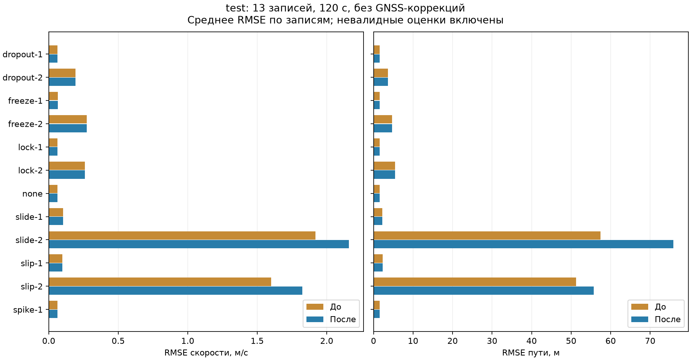

# Финальная проверка — 27 сентября 2026

Сдаваемая версия сохраняет алгоритм колёс из `f247d8e` и исправления runtime,
загрузчика эталона и сценариев. Изменения main до `974727c` сохранены.
Эксперимент `d6b55a3` с удержанием гипотезы slip **отклонён после test-проверки**.
Численные параметры модели и разбиение данных не менялись.

Команды: [JURY.md](JURY.md). Поля формы: [SUBMISSION.md](SUBMISSION.md).

## Что исправлено

- Согласован интерфейс геометрии ROS и тестов, сохранён fallback из main.
- Старые имена маршрутов GNSS-reference нормализованы; неизвестный маршрут
  вызывает явную ошибку вместо скрытого отключения уклона.
- Позиция публикуется без карты и после model-only горизонта, с корректным frame
  и диагностикой качества. Ошибки не улучшаются скрытием невалидных выходов.
- Добавлены двойная пробуксовка, юз одного/двух каналов, двойная блокировка
  и конечный дрейф в процентах дистанции.

## Методика

12 validation и 13 test-записей, без дубликатов между train/validation/test.
Окна 120 с, отказ с 50-й до 70-й секунды, профиль `configs/models/default.yaml`.
GNSS используется для независимого эталона и одной начальной пары s0/v0;
последующих коррекций нет (`gnss_mode=never`). Это не холодный старт.
Уклон берётся в оценённой позиции. Пробуксовка: множитель 1,5; юз: 0,5;
блокировка: 0. Отказы искусственные, входы реальные.

В таблице средние per-bag RMSE. Все конечные оценки, включая `valid=false`,
входят в ошибки. B0 — wheel-hold baseline; M1-cal — сдаваемый алгоритм.
Набор test использован как приёмочный контроль кандидата, а не для настройки
параметров. После отрицательного результата выполнен откат, без нового подбора.

## Метрики сдаваемого алгоритма на test

| Сценарий | RMSE скорости B0 → M1-cal, м/с | RMSE пути B0 → M1-cal, м |
|---|---:|---:|
| Чистые данные | 0,0748 → 0,0630 | 1,6841 → 1,5621 |
| Залипание одного | 0,7743 → 0,0654 | 21,1918 → 1,5558 |
| Залипание обоих | 1,5167 → 0,2738 | 41,6107 → 4,7041 |
| Пропуск одного | 0,0751 → 0,0630 | 1,6865 → 1,5591 |
| Пропуск обоих | 1,5167 → 0,1913 | 41,6107 → 3,6564 |
| Выбросы одного | 0,5593 → 0,0630 | 8,5069 → 1,5595 |
| Пробуксовка одного | 0,8685 → 0,0992 | 27,5128 → 2,2853 |
| Пробуксовка обоих | 1,7113 → 1,6003 | 54,7767 → 51,2657 |
| Юз одного | 0,8615 → 0,1029 | 27,1259 → 2,2200 |
| Юз обоих | 1,7035 → 1,9186 | 54,3746 → 57,4543 |
| Блокировка одного | 1,7032 → 0,0630 | 54,3677 → 1,5591 |
| Блокировка обоих | 3,3963 → 0,2612 | 108,9154 → 5,4280 |

Общий юз двух колёс остаётся хуже B0; универсальной устойчивости не заявляем.
Средний конечный дрейф M1-cal: чистые данные 0,320%, двойное залипание 0,798%,
двойной пропуск 0,690%, двойная пробуксовка 8,622%, двойной юз 9,066%,
двойная блокировка 1,175%. Это среднее процентов по записям:
`100*abs(s_est(end)-s_ref(end))/abs(s_ref(end)-s_ref(start))`,
не процент от суммарной дистанции.

Полные данные сдаваемого алгоритма и B0: [test-before.json](evidence/test-before.json).
Название before относится к отвергнутому эксперименту, а не к старой версии отчёта.
Алгоритмический файл сдаваемой версии идентичен этому baseline.

## Почему последнее изменение не вошло в релиз

Удержание обнаруженной пробуксовки/юза после отпускания контроллера улучшило
validation: двойная пробуксовка 1,6149 → 0,5445 м/с и 52,2864 → 15,0880 м.
Но на test стало хуже:

| Сценарий | Скорость baseline → кандидат, м/с | Путь baseline → кандидат, м |
|---|---:|---:|
| Пробуксовка обоих | 1,6003 → 1,8253 | 51,2657 → 55,6982 |
| Юз обоих | 1,9186 → 2,1582 | 57,4543 → 75,9061 |

Конечный дрейф тоже вырос: пробуксовка 8,622% → 17,338%, юз 9,066% → 16,946%.
Причина ограничения: ошибка открытого прогноза может удерживать ошибочную
гипотезу slip и мешать возврату исправных датчиков. Кандидат отклонён целиком;
успешный validation не выдаётся за улучшение сдаваемой версии.



Артефакты отклонённого эксперимента:
[validation baseline](evidence/validation-before.json),
[validation candidate](evidence/validation-after.json),
[test candidate](evidence/test-after.json).
JSON содержит SHA-256 исходных отчётов; графики воспроизводятся
`tools/plot_submission_metrics.py`.

## Проверки сборки и runtime

Четыре ROS-пакета собираются через colcon. Отдельно проверена чистая сборка
в подготовленной среде с `--network none`.
GitHub Actions выполняет Python/API, ROS-интеграционные проверки и сборку Vue.
Актуальный статус сдаваемой ветки:
[GitHub Actions](https://github.com/MuskatGroup/odometry-service/actions?query=branch%3Asubmission%2Ffinal-2026-09-27).
Статус предыдущего коммита не переносится на новый.

Проверка промежуточного `d6b55a3`: 129 passed / 12 skipped на хосте,
37 passed в Humble (10 integration + 27 core/fixed-lag), Ruff прошёл.
При откате удалены три тестовых случая, относящихся только к отклонённой логике.
Остальные регрессионные тесты сохранены.

ROS-прогон ниже относится **к промежуточному d6b55a3**, не к финальному откату:
`30618_88aea4d9`, offset 230 с, 120 с при 1×, GNSS disabled,
явные s0/v0 из JURY, лимиты 2 CPU / 512 МиБ.
Эталон bag — /localization/kinematic_state, не чистый GNSS.

| Показатель | Результат |
|---|---:|
| Оценки / валидные | 5804 / 5804 |
| RMSE скорости | 0,03539 м/с |
| RMSE 3D позиции | 0,16937 м |
| Частота обязательных выходов | 48,15 Гц |
| Худший rolling p99 callback→publication | 40,98 мс |
| Максимальная callback→publication | 88,08 мс |
| Peak RSS | 67,84 МиБ |
| Максимальная наблюдавшаяся CPU-оценка | 1,78 ядра |
| Исключения / слишком поздние входы | 0 / 0 |

[Исходный ROS-отчёт](evidence/ros-map-final.json); historical filename сохранён.
Задержка исключает транспорт до callback и не является hard real-time гарантией.
Все позиции этого участка в frame=map. Изменения runtime после этого прогона
не вносились, но алгоритм колёс откатан; результат не заявляется как новый replay релиза.

## Воспроизведение

```bash
uv run python -m odometry_lab.cli real-benchmark \
  --output artifacts/my-final-test --subset test \
  --model-profile configs/models/default.yaml --preset B0 --preset M1-cal --gnss-mode never
```

Для парного эксперимента baseline — f247d8e, кандидат — d6b55a3.
Использовать отдельные окружения или PYTHONPATH на соответствующие пакеты.
Исходный baseline-отчёт содержит 312 результатов (13 записей × 12 сценариев × 2 пресета).
Ограничения и план развития: [ROADMAP.md](ROADMAP.md).
