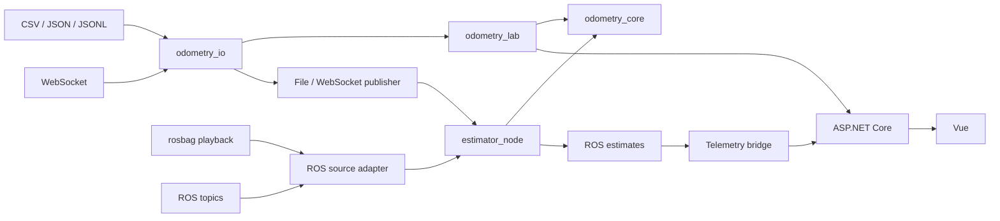

# Первый рабочий каркас odometry-service

## 1. Архитектура и результат

Создаем один репозиторий с полным стеком: Python-ядро, адаптеры всех заявленных источников, Failure Lab, ROS 2-пакеты, ASP.NET Core API и Vue-интерфейс. Основная среда интеграции — Linux-контейнеры Docker. Эксперименты запускаются из CLI; браузер показывает результаты и телеметрию.

Разделение ответственности:

| Компонент | Назначение |
|---|---|
| `odometry_msgs` | Определения ROS-сообщений. Здесь нет чтения файлов или вычислений |
| `odometry_io` | Подключение источников, разбор форматов, преобразование единиц и полей |
| `odometry_core` | Общие Python-типы, API оценивателя и расчет движения |
| `odometry_lab` | Генерация сценариев, запуск ядра, сравнение алгоритмов и отчеты |
| `odometry_node` | ROS-оболочка ядра, входной адаптер, replay и telemetry bridge |
| `apps/api` | Прием телеметрии, каталог запусков и хранение отчетов |
| `apps/web` | Графики, качество оценки и просмотр экспериментов |

`odometry_lab` — **потребитель ядра для испытаний**, а не обязательный интерфейс между ROS и алгоритмом.



Выделить компоненты в отдельные репозитории позднее будет возможно. Вынос математического ядра в сетевой микросервис не является целью: вызов библиотеки остается предпочтительным для вычислительного цикла.

## 2. Универсальный вход и API ядра

### Единый внутренний формат

Сохраняем предусмотренные контрактом Python-структуры:

- `ControlSample`: время, номер события, нормализованная ручка, достоверность.
- `WheelSample`: время, номер события, идентификатор колеса, линейная скорость, достоверность.
- `InitialState`, `EstimatorConfig`, `Estimate`.

Типы размещаем в отдельном модуле внутри `odometry_core`, без зависимостей от ROS. `odometry_io` импортирует эти типы; ядро не импортирует адаптеры.

Ядро получает обычные Python-объекты через существующий API:

```python
estimator.initialize(initial, config)
estimator.ingest_control(control_sample)
estimator.ingest_wheel(wheel_sample)
estimate = estimator.advance_to(timestamp_ns)
```

Одинаковые вызовы выполняют Lab и ROS-нода. Состояние каждого оценивателя изменяется последовательно.

### Устройство адаптеров

Разделяем два действия:

1. **Чтение источника:** получить строку файла, JSON-объект, WebSocket-сообщение или ROS-сообщение.
2. **Нормализация:** преобразовать полученные данные в `ControlSample` и `WheelSample`.

Профиль источника в YAML задает расположение полей, единицы, шкалу времени, соответствие положений ручки и идентификаторы колес. Для угловой скорости задается радиус каждого колеса. Поддерживаем таблицу соответствий дискретной ручки и линейное преобразование непрерывной.

Профиль не выполняет произвольный код. Для сложного нового формата добавляется Python-адаптер, сохраняющий тот же выходной контракт.

### Что работает в первой версии

- **CSV:** строки событий либо строки с ручкой и несколькими колесными колонками; названия и разделитель задаются профилем.
- **JSON:** массив записей либо массив по указанному пути внутри объекта.
- **JSONL:** одна запись на строку.
- **WebSocket:** клиент подключается к заданному серверу и принимает JSON-записи; тестовый сервер входит в стенд.
- **ROS topics:** адаптер подписывается на настроенные типы и извлекает поля по профилю; соответствующие ROS-пакеты типов должны быть установлены.
- **rosbag:** штатное воспроизведение через ROS с последующим использованием того же ROS-адаптера. Отдельный офлайн-декодер bag в первый этап не входит.

Колесные каналы задаются списком в профиле, без фиксированного числа в алгоритме.

Неизвестные единицы или отсутствующий обязательный mapping останавливают запуск с понятной ошибкой конфигурации. Поврежденные записи пропускаются с диагностикой и счетчиком; отсутствие измерения не преобразуется в ноль.

### Время и качество входов

- Внутри Python время хранится целыми наносекундами; в JSON — строкой.
- Все источники запуска приводятся к одной явно заданной шкале времени.
- Для файлов события упорядочиваются до воспроизведения; одинаковые timestamp обрабатываются одной группой перед публикацией.
- В live-режиме запоздавшие и повторные события отклоняются с диагностикой. Восстановление прошлого состояния фильтра в первой версии не реализуется.
- Очереди ограничены; переполнение видно в диагностике.
- При разрыве WebSocket прекращается поступление измерений, срабатывает контроль свежести. Автоматическое переподключение в первом каркасе не предусмотрено.

## 3. Работающий каркас всех компонентов

### Ядро и Failure Lab

Создаем заменяемый интерфейс оценивателя и первую реализацию `wheel-hold`: скорость по доступным колесам с интегрированием пути и контролем устаревания. Для нескольких свежих каналов используем медиану.

Это демонстрационный baseline, а не готовая адаптивная модель. Его неопределенность обозначается как некалиброванная; нулевая ковариация не используется для создания видимости точности.

Lab предоставляет CLI-команды:

- `generate` — синтетический разгон, выбег, торможение и заданные отказы;
- `run` — запуск выбранного источника через ядро;
- `evaluate` — расчет ошибок по отдельному эталону;
- `import-report` — загрузка сохраненного результата в API.

Каждый запуск сохраняет конфигурацию, входные события, оценки и отчет. Эталон и метки искусственных отказов доступны только испытательному инструменту.

### ROS

Создаем пакет сообщений и Python-пакет нод:

- входной адаптер и издатель файловых/WebSocket-событий;
- `estimator_node`, импортирующий ядро;
- отдельный `telemetry_bridge`.

Сохраняем топики из существующего контракта. Для некалиброванного baseline добавляем явный признак доступности оценки неопределенности в Python-, JSON- и ROS-представлениях. Расширенный результат публикуется всегда; совместимое `Odometry` — только при действительной оценке и наличии пригодной ковариации.

ROS-часть запускается без web. Файловый replay и bag используют симуляционное время с одним издателем `/clock`.

### Backend и frontend

ASP.NET Core API реализует существующие endpoints запусков, телеметрии и отчетов, а также SignalR. SQLite принадлежит только API; полные записи хранятся файлами. Готовые отчеты импортируются через API.

Vue предоставляет список запусков и экран эксперимента: ручка, скорости отдельных колес, оценка, эталон при наличии, путь, режим качества и метрики. Неопределенность отображается только при ее наличии. Потеря связи со стендом отличается от недостоверности алгоритма.

Запуск процессов из браузера, ML-классификатор, LLM и Rust не входят в первый каркас.

## 4. Сборка, распределение и приемка

Используем Python 3.10, ROS 2 Humble на Ubuntu 22.04, .NET 10, Vue 3/TypeScript и Node.js 22 для frontend-сборки. Python-пакеты оформляем через `pyproject.toml`; зависимости web фиксируем lock-файлом. Подготавливаем Docker-сборки и Compose-профили для демонстрации и испытаний.

Распределение:

- **DS:** типы и API ядра, baseline.
- **Автоматизатор:** генератор, Failure Lab, evaluator и фикстуры.
- **Архитектор:** адаптеры, ROS, Docker и общие контракты.
- **Full-stack A:** API, SignalR, хранение и импорт.
- **Full-stack B:** Vue, графики и состояния интерфейса.

Критерии приемки:

1. Эквивалентные записи CSV, JSON и JSONL дают одинаковые нормализованные события и оценки.
2. WebSocket-пример проходит через тот же преобразователь; отключение источника приводит к диагностируемой потере свежести.
3. ROS-источник и его записанный bag проходят через один адаптер и дают согласованные результаты.
4. Проверены преобразования RPM/rad/s/m/s, несколько колес, пропуски, дубликаты, поздние события и неверные профили.
5. На постоянной скорости 10 м/с за 5 секунд при согласованных начальных условиях получается приращение пути 50 м.
6. Отсутствие эталона дает недоступные метрики, а не нулевую ошибку.
7. Отключение API и браузера не останавливает ROS-оцениватель.
8. Один документированный запуск демонстрации создает синтетический эксперимент и показывает его в браузере.

Пока формат организаторов неизвестен, гарантия совместимости относится к нашим документированным примерам и профилям. После получения материалов первым шагом будет подключение реального источника и сквозной прогон; математический алгоритм при этом не должен требовать изменений из-за формата доставки.
